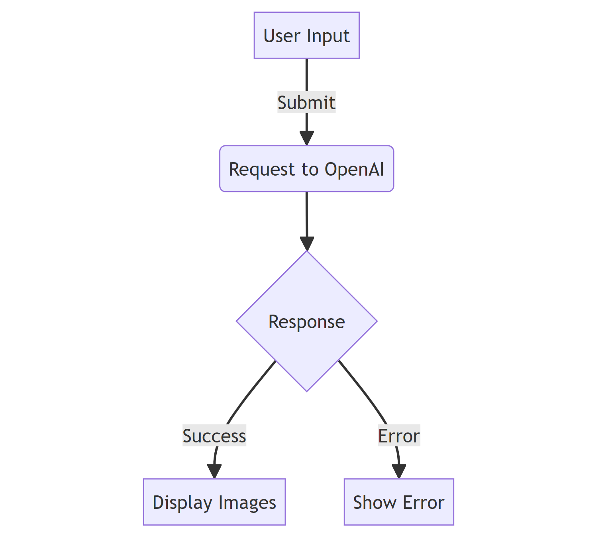
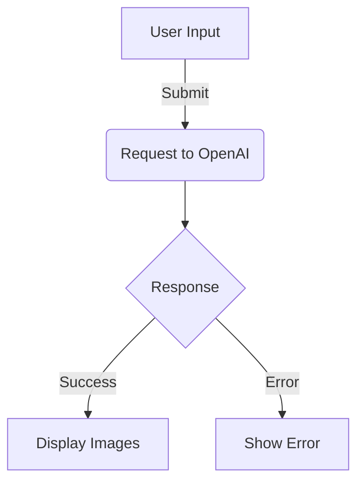
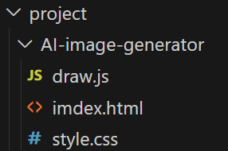

# Banksy
- 모든 인적 사항이 정체불명인 영국의 아티스트 뱅크시에게 영감을 받아 만들게 된 AI 이미지 생성기
지피티 API를 활용한 AI 이미지 플랫폼 

## 1. 목표와 기능

### 1.1 목표
Banksy 프로젝트는 그림을 그릴 줄 모르거나 다양한 그림에 대한 아이디어가 필요한 사용자가 간편하게 AI를 활용하여 이미지를 생성하고 공유하는 데에 목적이 있습니다. 

### 1.2 기능
- **이미지 생성:** 사용자가 입력한 텍스트 또는 주제를 기반으로 AI를 활용하여 이미지를 생성합니다.
- **이미지 공유:** 생성된 이미지를 손쉽게 다운로드하거나 공유할 수 있습니다.
- **확장 가능성:** 추가적인 AI 모델 및 기능의 통합을 통해 서비스를 확장할 수 있습니다.

### 1.3 팀 구성
<table>
	<tr>
		<th>진성현</th>
	</tr>
 	<tr>
		<td></td>
	</tr>
</table>

## 2. 개발 환경 및 배포 URL

### 2.1 개발 환경
- **Frontend:** HTML, CSS, JavaScript
- **AI 모델:** OpenAI API

### 2.2 배포 URL
- [프로젝트 배포 URL](배포 URL을 입력하세요)

### 2.3 URL 구조(모놀리식)
- [배포 URL]/generate-image
- [배포 URL]/download-image
- [배포 URL]/share-image

### 2.4 URL 구조(마이크로식)
- [generate.image.yourdomain.com]
- [download.image.yourdomain.com]
- [share.image.yourdomain.com]

## 3. 요구사항 명세와 기능 명세
- https://www.mindmeister.com/ 등을 사용하여 모델링 및 요구사항 명세를 시각화 하였습니다.

## 4. 프로젝트 구조와 개발 일정

### 4.1 프로젝트 구조

### 4.1 개발 일정(WBS)
각 단계별로 프로젝트의 일정을 구체적으로 계획하고 마일스톤을 설정합니다.

## 5. 역할 분담
팀원들의 역할과 책임을 분명히 정의하고 협업 계획을 수립합니다.

## 6. 와이어프레임 / UI / BM

### 6.1 와이어프레임
각 화면의 와이어프레임을 작성하여 사용자 경험을 시각적으로 나타냅니다.

### 6.2 화면 설계
와이어프레임을 기반으로 각 화면의 UI를 디자인하고 비즈니스 모델을 설명합니다.

## 7. 데이터베이스 모델링(ERD)
필요시 데이터베이스를 구축하기 위한 ERD를 작성합니다.

## 8. Architecture
프로젝트의 아키텍처를 설명하고 각 구성 요소의 역할을 명시합니다.

## 9. 메인 기능
주요 기능에 대한 상세한 설명을 작성합니다.

## 10. 에러와 에러 해결
예상되는 에러들과 그에 대한 해결책을 문서화합니다. 프로젝트 진행 중 발생하는 에러에 대응할 수 있도록 팀원들에게 유용한 정보를 제공합니다.
