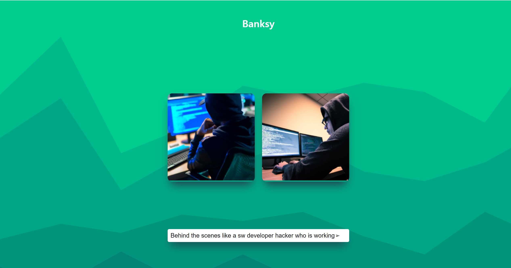

# Banksy
- 모든 인적 사항이 정체불명인 영국의 아티스트 뱅크시에게 영감을 받아 만들게 된 AI 이미지 생성기
지피티 API를 활용한 AI 이미지 플랫폼 

## 1. 목표와 기능

### 1.1 목표
Banksy 프로젝트는 그림을 그릴 줄 모르거나 다양한 그림에 대한 아이디어가 필요한 사용자가 간편하게 AI를 활용하여 이미지를 생성하고 공유하는 데에 목적이 있습니다. 

### 1.2 기능
- **이미지 생성:** 사용자가 입력한 텍스트 또는 주제를 기반으로 AI를 활용하여 이미지를 생성합니다.
- **이미지 공유:** 생성된 이미지를 손쉽게 다운로드하거나 공유할 수 있습니다.
- **확장 가능성:** 추가적인 AI 모델 및 기능의 통합을 통해 서비스를 확장할 수 있습니다.

### 1.3 팀 구성
<table>
	<tr>
		<th>진성현</th>
	</tr>
 	<tr>
		<td></td>
	</tr>
</table>

## 2. 개발 환경 및 배포 URL

### 2.1 개발 환경

- **개발 환경(IDE)** : VSCode
- **Frontend:** HTML, CSS, JavaScript
- **AI 모델:** OpenAI API DALL·E  
- **서비스 배포 환경:** GitHub

### 2.1.1 AI 모델 참고자료
- https://platform.openai.com/docs/guides/images/introduction?context=node

### 2.2 배포 URL

- (Banksy)[https://jinseonghyun.github.io/AI_image_Banksy/]

## 3. 요구사항 명세와 기능 명세
- https://www.mindmeister.com/ 등을 사용하여 모델링 및 요구사항 명세를 시각화 하였습니다.


## 4. 프로젝트 구조와 개발 일정

### 4.1 프로젝트 구조

📂AI-image-Banksy  
 ┣ 📜draw.js  
 ┣ 📜index.html  
 ┣ 📜style.css  

 ```mermaid
graph TD
    A[프로젝트 요구사항 및 기능] --> B(주제 선정)
    A --> C(WBS 작성)
    A --> D(UI 제작)
    A --> E(UI 확정)
    A --> F(API 확인)
    A --> G(추가 구성)
    B --> H(디자인)
    H --> I(디자인)
    B --> J(FE 메인)
    J --> K(배경 확정)
    J --> L(입력창 등록)
    J --> M(구성요소 수정)
    J --> N(기능 확인)
```

### 4.2 개발 일정(WBS)


## 5. 역할 분담
개인 프로젝트
- FE : 진성현
- 디자인 : 진성현
## 6. 와이어프레임 / UI / BM

### 6.1 와이어프레임
- 카카오 오븐을 사용하여 UI를 설계하였습니다.


### 6.2 화면 설계



## 7. 데이터베이스 모델링(ERD)


## 8. Architecture


## 9. 메인 기능
제가 만든 AI 이미지 제작 서비스는 사용자의 요구사항을 연동된 API를 통해 실시간으로 chatGPT와 통신하면서 사용자가 요구하는 필요조건에 맞추어 IMG 를 생성하는 서비스입니다.


## 10. 에러와 에러 해결
1. API를 연동하여 이미지를 생성하고 UI에 업로드 하는 과정에서 에러가 발생하였는데 내가 준 draw.js에 body 에 설정해주었던 n 과 size의 문제였다. 그래서 UI가 감당할 수 있는 값들로 변경 후 결과값이 잘 출력되는 것을 관찰하였다.

2. 웹 서비스 Banksy 를 만들고 서비스를 배포한 후 일단 기능 구현은 된다고 생각해서 신나게 실험을 하나보니까 페이지 에러가 났다. 이유를 찾다보니 GitHub에 코드를 업로드 하는 과정에서 API_KEY 값이 노출되어서 API_KEY 값이 계속 삭제 되었다. 이유를 파악하고 현재 업로드 한 코드에서 키 값을 제거한 상태이다. 추후 백엔드에 대해서 공부를 하여 이 에러를 키를 숨기면서도 해결해 보고 싶다.

## 11. 개발하며 느낀점
정말 많이 부족하다고 느꼈다. 회사에서 신입을 왜 안뽑을려고 하는지 바로 이해할 수 있는 개인 프로젝트 시간이었다. 아이디어나 기획자체에서는 해보고 싶은 것이 정말 많고 여러 기능을 구현하고 싶었는데 막상 주제에 가장 기초적인 이미지를 그려주게 하는 것 부터 구현하는데 무척 애를 먹었다. 요즘은 인공지능이 발달하여 chatGPT라는 실시간으로 정보를 얻을 수 있는 AI가 존재하기에 적극 활용하였지만 이것이 없었다면 내가 과연 이걸 완성할 수 있었을까?? 라는 생각을 정말 많이했다. 이번 계기로 나의 부족함을 한번 더 상기시키는 경험이 되었고 내가 가고자 하는 목표에 가까워 질 수 있도록 더욱 지식을 공부하고 역량을 늘려나가겠다 다짐했다.